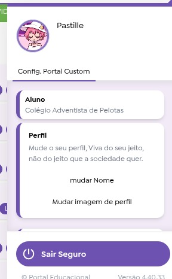
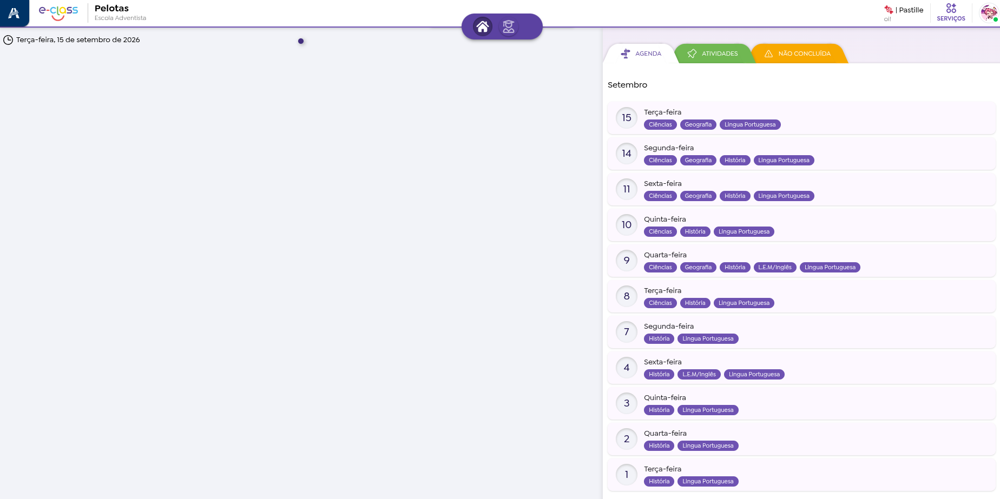

# Portal-Custom - Modifique oque quer

Extensão para adicionar funcionalidades ao Eclass!

Você pode mudar os widgets que aparecem no menu principal do Eclass!

# Lembrando: 
# Esta extensão não avisa o servidor, não chama o servidor Não rouba seu token, você pode analisar o codigo. o projeto é 100% Codigo aberto.
Extensão feita por um menino que odeia a interface do eclass.
